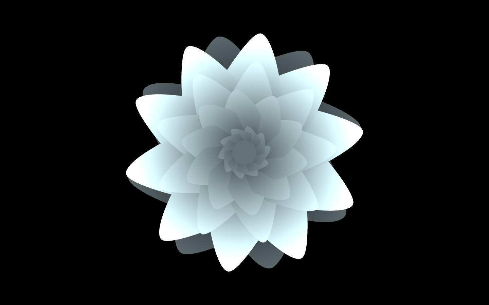

# Irreversible

> Abstract flowers with colors generated from text files

Randomly generated flowers whose colors are determined by text files. The text is converted into hex format, split into six character lines, and read by the program. Flowers are generated and given these colors in order, allowing the viewer to "read" the text by skimming through the flowers.

### To Run

Clone the repo, change into the directory by doing `cd irreversible`, then just run `npm install`, then `npm run start`, followed by `make RunRelease`. You'll need to have openFrameworks, Node, Npm, and Make installed to run.